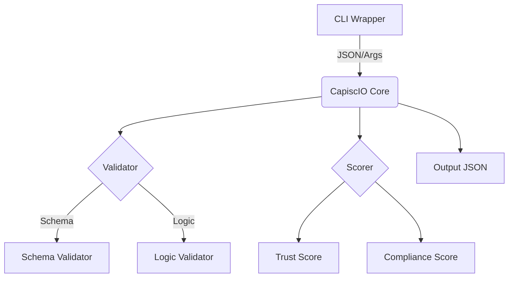

# Architecture

The CapiscIO Core binary is designed as a high-performance, standalone executable that handles the heavy lifting of the A2A protocol validation.

## Overview

The core binary (`capiscio`) is written in Go and provides:

1.  **Validation Engine**: Validates Agent Cards against the schema.
2.  **Scoring Engine**: Calculates Trust, Compliance, and Utility scores.
3.  **Crypto Engine**: Verifies JWS signatures and handles key management.

## Diagram

